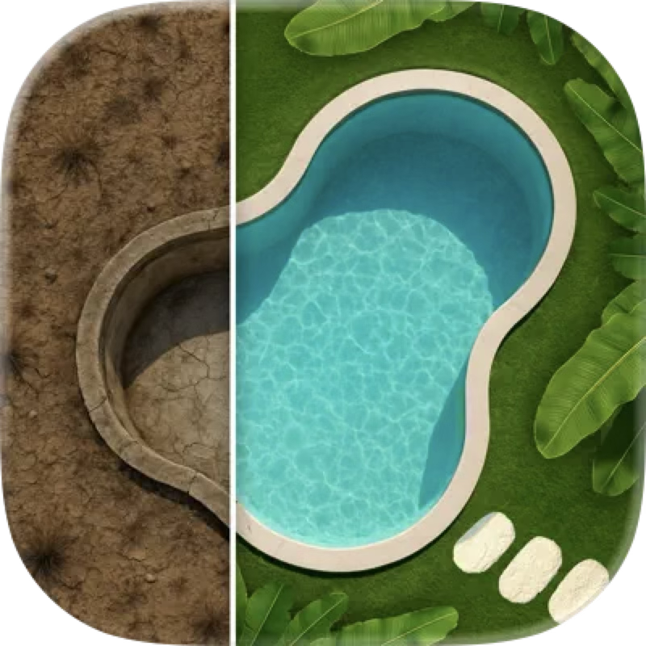

<p align="center">
  
</p>

# ClawJS

> [!WARNING]
> ClawJS is currently experimental, pre-beta software. Expect severe breaking changes without notice, including changes to APIs, CLI behavior, config formats, workspace layout, and stored data structures.
>
> Do not use ClawJS in production. Do not connect it to sensitive systems, real user data, paid APIs, security-critical services, or important integrations.
>
> Use it only for local evaluation and disposable test setups, ideally on an isolated machine, VM, or sandboxed environment. Assume things can fail, data can break, and migrations may not exist yet.

ClawJS is an open-source Node.js SDK and CLI for building local applications on top of multiple runtimes through one runtime-adapter contract.

You can use the same system in three ways:

| Surface | Best for | Example |
| --- | --- | --- |
| SDK | application code running locally in Node.js | `claw.sessions.listSessions()` |
| CLI | local operator and automation flows in a shell | `claw sessions list --json` |
| Relay API | remote browser, mobile, or server clients over HTTPS | `GET /v1/tenants/:tenantId/agents/:agentId/workspaces/:workspaceId/sessions` |

Full comparison: [docs/interface-matrix.md](docs/interface-matrix.md)

Maintainer: Iván González Dávila ([`@ivangdavila`](https://github.com/ivangdavila)).
Repository ownership, issue tracking, and package publishing live under [`@clawic`](https://github.com/clawic).

## Packages

- `@clawjs/cli`: official CLI
- `@clawjs/claw`: official SDK
- `@clawjs/workspace`: local-first workspace productivity companion
- `@clawjs/node`: compatibility wrapper for existing integrations
- `@clawjs/core`: shared contracts and schemas
- `@clawjs/openclaw-plugin`: OpenClaw bridge plugin
- `@clawjs/openclaw-context-engine`: experimental OpenClaw context engine
- `create-claw-app`: Next.js starter scaffold
- `create-claw-agent`: agent-first repository scaffold
- `create-claw-server`: headless Node.js server scaffold
- `create-claw-plugin`: distributed plugin package scaffold
- `eslint-config-claw`: shared ESLint flat config

## Relay

The repository also includes `relay/`, a standalone relay backend for remote clients that need a public HTTPS API in front of remote ClawJS or OpenClaw agents.

Relay v1 adds:

- `/v1` JWT-based client auth
- device-code pairing for reverse connectors
- reverse WebSocket connector sessions for agents behind NAT
- shared browser sessions per workspace with human takeover over the same persisted Chromium profile
- explicit routing by `tenantId`, `connectorId`, `agentId`, and `workspaceId`
- first-class `project + agent + assignment` routing on top of materialized workspaces
- an admin-only surface for runtime setup, config, and connector enrollment

Docs: [docs/relay.md](docs/relay.md)

## Database

The repository also includes `database/`, a standalone namespace-based data service for remote agents and clients.

Database v1 adds:

- schema-first collections with protected built-ins for `people`, `tasks`, `events`, and `notes`
- namespace isolation on top of one SQLite file
- scoped API tokens for agents and apps
- realtime record events over WebSocket
- local file storage plus a built-in admin console

Docs: [docs/database.md](docs/database.md)

## Time

The repository also includes `time/`, a standalone temporal control plane for calendar events, routines, reminders, deadlines, and conditional follow-ups.

Time v1 adds:

- one canonical temporal model for `event`, `routine`, `reminder`, `deadline`, and `follow_up`
- one-off, cron, RRULE, and relative scheduling semantics with timezone-aware normalization
- execution history plus projection records for workspace, relay, runtime scheduler, notify, and calendar sync targets
- a dedicated operator UI plus `claw time ...` and `claw schedule ...` bridges

Docs: [docs/time.md](docs/time.md)

## Claw Day

The repository also includes `apps/day/`, a private visual planning app for ClawJS projects, goals, tasks, timelines, and progress logs.

Claw Day v1 adds:

- a browser UI for today's focus, queued work, completed work, timelines, and logs
- forms and visual views over the shared WorkOS productivity model
- direct storage in the ClawJS workspace productivity layer; CLI workflows remain on the main `claw` productivity commands

Docs: [docs/day.md](docs/day.md)

## ERP

The repository also includes `erp/`, a standalone ERP backend with its own transactional SQLite store, CLI, domain API, app read-model API, frontend contract fixtures, and a reserved SPA mount for a future `erp/ui/`.

ERP v1 adds:

- multi-tenant and legal-entity bootstrap
- ledger-first document posting for sales, purchases, inventory, projects, manufacturing, payroll, approvals, and audit
- a dedicated `erp ...` CLI plus `claw erp ...` bridge
- `/v1/app/*` read models, OpenAPI, fixtures, and an exhaustive frontend checklist for the future SPA

Docs: [erp/README.md](erp/README.md)

## Content

The repository also includes `content/`, a standalone CMS + social publishing control plane for authoring, variants, approvals, scheduling, and publication.

Content v1 adds:

- brands, campaigns, destinations, and capability maps
- canonical entries plus immutable revisions
- Drive-backed asset references instead of local binary storage
- destination-specific variants with validation and approval flows
- publish plans, publication runs, retries, and a dedicated placeholder mount for the future SPA

Docs: [docs/content.md](docs/content.md)

## Notify

The repository also includes `notify/`, a standalone notification delivery backend for source apps, mobile client apps, device installations, subscriptions, receipts, and sync feeds.

Notify v1 adds:

- source app tokens for trusted emitters
- separate client app registration for iOS and Android delivery targets
- device-installation registration plus authenticated client feed sync
- subscription-based routing by `project`, `agent`, `workspace`, `eventType`, and severity
- critical receipts with ack, cancel, expiration, and idempotent notification ingest
- glance/status updates alongside normal alert delivery

Docs: [docs/notify.md](docs/notify.md)

## IoT

The repository also includes `iot/`, a standalone local-first IoT control plane for homes, areas, things, connectors, scenes, automations, approvals, and event timelines.

IoT v1 adds:

- one canonical home/area/thing/capability model for agents
- semantic actions such as lights, climate, scenes, and approvals
- deterministic automation records plus manual execution
- approval-required flows for restricted devices like locks
- a dedicated operator console plus `claw iot ...` CLI bridge

Docs: [docs/iot.md](docs/iot.md)

## Vault

The repository also includes `vault/`, a standalone multitenant secret broker for agents and trusted local sidecars.

Vault v1 adds:

- non-exportable secret storage by default with envelope encryption per version
- a typed secret catalog with structured metadata for common providers such as npm, Telegram, Slack, and RevenueCat
- policy-based brokered HTTP execution so callers use `secretName` references instead of raw credentials
- explicit secret capability and typed action discovery for SDK, CLI, sidecars, and operators
- short-lived `process` and `browser` leases for host-bound login flows through a trusted local sidecar
- a compatibility sidecar that preserves the `{{secretName}}` contract used by the current secrets proxy
- a built-in admin console plus a native macOS operator app for secrets, policies, principals, audit, and active leases

Docs: [docs/vault.md](docs/vault.md)

## Drive

The repository also includes `drive/`, a standalone Google Drive-style local-first product for folders, native Docs/Sheets/Slides, uploads, previews, revisions, comments, share links, and agent tokens.

Docs: [docs/drive.md](docs/drive.md)

## Execution Plane

The repository also includes `execution-plane/`, a standalone control plane for agent-authored code, remote workers, runs, artifacts, notebooks, review flows, and deployments.

The current implementation ships as a self-contained top-level service with:

- a multitenant Fastify + SQLite control plane
- reverse-connected workers over WebSocket
- Git-native repositories, revisions, and change requests
- scripts and notebooks on one shared run model
- run artifacts, workflows, and deployment promotion
- a bundled React UI for operators

Docs: [execution-plane/README.md](execution-plane/README.md)

## Delegation Plane

The repository also includes `delegation-plane/`, a standalone durable control plane for async agent delegation trees, bounded worker execution, leases, retries, and continuation-based parent resumption.

Delegation Plane v1 adds:

- persistent graphs, nodes, dependencies, workers, runs, logs, and events
- scheduler ticks for lease reclamation, retry policy, terminal propagation, and continuation creation
- structured agent-facing endpoints for child delegation, completion, failure, blocking, and status inspection
- a generic runtime adapter contract with deterministic and command adapters
- an operator CLI for graph creation, inspection, retry, cancel, worker claim, and stuck-work views

Docs: [docs/delegation-plane.md](docs/delegation-plane.md)

## Install

Use the SDK:

```bash
npm install @clawjs/claw
```

Install the CLI globally:

```bash
npm install -g @clawjs/cli
claw --help
```

Or run the latest CLI without a global install:

```bash
npx @clawjs/cli@latest --help
```

Use both in the same app when you want local scripts plus the SDK:

```bash
npm install @clawjs/claw
npm install -D @clawjs/cli
```

Bootstrap a project through the official CLI:

```bash
claw new app my-claw-app
cd my-claw-app
npm run claw:init
npm run dev
```

Add capabilities inside an existing project:

```bash
claw generate skill support-triage
claw add telegram
claw add workspace
claw agents codex setup
claw channels telegram setup --account support --secret-name telegram_support_bot_token
claw channels assign --channel telegram --account support --agent codex
claw channels listen start --channel telegram --account support --background
claw info --json
```

The older `create-claw-app`, `create-claw-agent`, `create-claw-server`, and `create-claw-plugin` packages remain available as compatibility wrappers. They now delegate to the same scaffolding engine as `claw new`.

## Quick start

Probe a runtime:

```bash
claw --runtime openclaw runtime status --json
```

Initialize a workspace:

```bash
claw --runtime openclaw workspace init \
  --workspace ./workspace \
  --app-id demo \
  --workspace-id demo-main \
  --agent-id demo-main
```

The example uses the same value for `workspaceId` and `agentId` as a convenience default. Those concepts remain separate: the workspace is the isolated context, and the agent is the identity operating inside it.

Create the same instance through the SDK:

```ts
import { Claw } from "@clawjs/claw";

const claw = await Claw({
  runtime: {
    adapter: "openclaw",
    // Optional: point directly at the installed OpenClaw binary
    // when the current PATH does not include it.
    binaryPath: "/opt/openclaw/bin/openclaw",
  },
  workspace: {
    appId: "demo",
    workspaceId: "demo-main",
    agentId: "demo-main",
    rootDir: "./workspace",
  },
});

const status = await claw.runtime.status();
console.log(status.capabilityMap);
```

If the OpenClaw CLI is installed outside the current `PATH`, set `runtime.binaryPath` in code or export `CLAWJS_OPENCLAW_PATH`.

## One Capability, Three Surfaces

The same capability can usually be reached through the SDK, the CLI, or
the Relay API:

`WS = /v1/tenants/:tenantId/agents/:agentId/workspaces/:workspaceId`

| Task | SDK | CLI | Relay API |
| --- | --- | --- | --- |
| List sessions | `claw.sessions.listSessions()` | `claw sessions list` | `GET WS/sessions` |
| Create a session | `claw.sessions.createSession()` | `claw sessions create --title "Support"` | `POST WS/sessions` |
| Ensure shared browser | `-` | `claw browser ensure --relay-url ...` | `POST WS/browser/session` |
| Read one session | `claw.sessions.getSession(sessionId)` | `claw sessions read --session-id <id>` | `GET WS/sessions/:sessionId` |
| Search sessions | `claw.sessions.searchSessions({ query: "invoice" })` | `claw sessions search --query "invoice"` | `GET WS/sessions:search?q=invoice` |
| Stream a reply | `for await (const ev of claw.sessions.streamAssistantReplyEvents(...))` | `claw sessions stream --session-id <id> --events` | `POST WS/sessions/:sessionId/stream` |
| Generate a title | `claw.sessions.generateTitle({ sessionId })` | `claw sessions generate-title --session-id <id>` | `POST WS/sessions/:sessionId/generate-title` |
| List skills | `await claw.skills.list()` | `claw skills list` | `GET WS/skills/list` |
| Search skills | `await claw.skills.search({ query: "calendar" })` | `claw skills search --query "calendar"` | `GET WS/skills/search?q=calendar` |
| List tasks | `await workspace.tasks.list()` | `claw tasks list` | `GET WS/tasks` |
| List temporal items | `await claw.time.list()` | `claw time list` | `GET WS/time` |
| Generate or register an image | `await claw.image.create(...)` / `await claw.image.import(...)` | `claw image create --prompt "..."` / `claw image import --file ...` | `POST WS/images` |
| Recover sent media | `claw.media.search({ query: "invoice" })` | `claw media search --query invoice` | `-` |
| Create and render a slide deck | `-` | `claw slides create`, `claw slides render --format pdf,pptx,html,png` | `-` |

In the rows that use `workspace.*`, that surface comes from
`@clawjs/workspace` on top of the base SDK.

That split is intentional:

- use the SDK when you are writing app code
- use the CLI when you are driving a local workspace from scripts or a shell
- use the Relay API when you need remote clients to call the same agent over HTTPS

## Project scaffolding

The official project entrypoint is now `claw new`.

Supported v1 project types:

- `claw new app`
- `claw new agent`
- `claw new server`
- `claw new workspace`
- `claw new skill`
- `claw new plugin`

Inside a generated project, the main productivity flow is:

- `claw generate skill|plugin|provider|channel|command`
- `claw add provider|channel|telegram|scheduler|memory`
- `claw info`

`create-claw-app` still exists for teams that want a `create-*` style workflow, but it is no longer the primary path in the docs.

## Workspace productivity companion

Install the local-first workspace layer when you want tasks, notes, people, inbox, events, search, and context helpers on top of the base SDK:

```bash
npm install @clawjs/workspace
```

Or add it inside an existing Claw project through the CLI:

```bash
claw add workspace
```

The productivity package extends the base SDK with:

- `tasks`, `notes`, `people`, `inbox`, and `events` CRUD
- workspace-wide search and context bundles
- UI metadata for surfaces and tools
- local JSON and asset storage under `.clawjs/data`

## Next.js starter

`claw new app` is the primary way to scaffold the Next.js app starter.

The generated starter is intentionally small:

- Next.js App Router
- `@clawjs/claw` in a server helper
- `/api/claw/status` route handler
- local `claw` scripts powered by `@clawjs/cli` for workspace bootstrap and runtime checks
- `claw.project.json` so `claw generate` and `claw add` can extend the repo later

It defaults to the `demo` adapter so the project runs immediately. Switch the generated scripts and `src/lib/claw.ts` to `openclaw` when you are ready to target a real runtime.

## Prompt ideas for your guide

If you want to evaluate ClawJS with `openclaw`, give your guide one of these prompts and ask it to build the app end-to-end:

- Use ClawJS to build an operations dashboard for `openclaw` that shows runtime status, capability health, recent sessions, and transport fallbacks in one screen.
- Use ClawJS to build a local-first chat app on top of `openclaw` with session history, streaming replies, retry visibility, and searchable transcripts.
- Use ClawJS to build a workspace assistant that turns natural language requests into tasks, notes, inbox items, and follow-up reminders.
- Use ClawJS to build a support triage console that reads incoming tickets, suggests replies, groups similar issues, and stores the decision trail in the workspace.
- Use ClawJS to build a meeting copilot that captures notes, extracts action items, assigns owners, and keeps a searchable memory of every session.
- Use ClawJS to build a release control room that summarizes commits, open issues, docs gaps, and risk signals before we ship.
- Use ClawJS to build a sales copilot that keeps account notes, call summaries, next steps, and a daily briefing for each customer.
- Use ClawJS to build a research workspace that ingests documents, lets me chat with them, and saves the useful findings back into project memory.
- Use ClawJS to build a command center for automations where I can inspect agents, scheduled jobs, tool activity, and workspace audit history.
- Use ClawJS to build a plugin-ready internal app that starts with chat and workspace flows today, but can grow later with new providers, channels, and skills.

## Adapter support

ClawJS now treats adapter support level as part of the public contract.

| Adapter | Stability | Support level | Recommended |
| --- | --- | --- | --- |
| `openclaw` | stable | production | yes |
| `codex` | experimental | experimental | no |
| `zeroclaw` | experimental | experimental | no |
| `picoclaw` | experimental | experimental | no |
| `nanobot` | experimental | experimental | no |
| `nanoclaw` | experimental | experimental | no |
| `nullclaw` | experimental | experimental | no |
| `ironclaw` | experimental | experimental | no |
| `nemoclaw` | experimental | experimental | no |
| `hermes` | experimental | experimental | no |
| `demo` | demo | demo | no |

Full policy: [docs/support-matrix.md](docs/support-matrix.md)

## Capability model

Every runtime status includes a `capabilityMap`. Capabilities are explicit and must obey one invariant:

- `supported=false` means `status="unsupported"`
- `status="unsupported"` means `supported=false`

ClawJS does not pretend unsupported subsystems exist.

## Docs

- [Getting started](docs/getting-started.md)
- [CLI reference](docs/cli.md)
- [Database service](docs/database.md)
- [IoT control plane](docs/iot.md)
- [API reference](docs/api.md)
- [Interface matrix](docs/interface-matrix.md)
- [Workspace model and productivity layer](docs/workspace.md)
- [Terminology](docs/terminology.md)
- [Setup and first workspace checklist](docs/setup.md)
- [Files and templates](docs/files.md)
- [Sessions and streaming](docs/sessions.md)
- [Authentication](docs/authentication.md)
- [Diagnostics and repair](docs/diagnostics.md)
- [Template packs and bindings](docs/template-packs-and-bindings.md)
- [Auth, compat, and doctor](docs/auth-compat-and-doctor.md)
- [Runtime migration notes](docs/runtime-migration-notes.md)
- [Support matrix](docs/support-matrix.md)
- [Public surface](docs/surface.md)
- [E2E and smoke tests](tests/e2e/README.md)
- [Demo terminology note](docs/demo-terminology-note.md)

## Repository development

```bash
npm ci
npm --prefix demo ci
npm --prefix website ci
npx playwright install --with-deps chromium
npm run ci
```

The release gate intentionally includes tests, typechecks, package builds, website build, docs validation, tarball smoke tests, and the blocking hermetic Playwright suite.

Git and release branch policy: [docs/git-workflow.md](docs/git-workflow.md)

## Sponsors

<a href="https://apps.apple.com/app/id6745303581">
  
</a>
