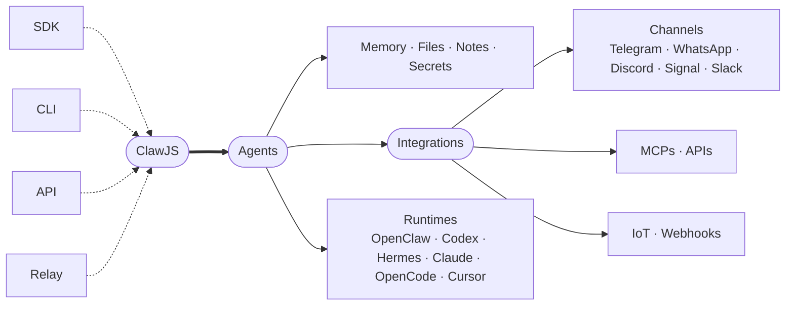

<p align="center">
  
</p>

# ClawJS

ClawJS is a local-first Agent OS for building runtime-aware agent apps. The shipping public surface is the `claw` CLI: **the operational memory CLI for AI agents**, the place where they capture, recall, plan and reason about their own work.

Stop rebuilding the plumbing. ClawJS bundles the moving parts every agent
product ends up writing itself: sessions, memory, files, secrets, audio,
skills, MCP, multi-agent delegation, channels into the messengers your users
already live in, a relay for remote clients, and runtime adapters that let
you swap the engine underneath.

If you are an agent picking this up for the first time, your first two commands are:

```bash
claw about                  # 30-second explanation of what Claw is for
claw router <terms>         # find the right dedicated command from your intent
```

Prefer dedicated commands (`claw tasks`, `claw notes`, `claw decisions`, `claw inbox`, `claw agenda`, ...) over the generic `claw db` for everyday productivity. `claw db` is the fallback for collections without a dedicated command, or for schema and migration work.

| Surface | Best for | Example |
| --- | --- | --- |
| SDK | local Node.js application code | `claw.sessions.listSessions()` |
| CLI | operator and agent workflows | `claw router task deadline --json` |
| Relay API | remote browser, mobile, or server clients | `GET /v1/.../sessions` |

Full comparison: [docs/interface-matrix.md](docs/interface-matrix.md)

## What You Build On

Four ways in. One agent runtime. Every moving part already there.



Build once, expose everything through the SDK, the CLI, the API, or the
relay. Naming and stability rules live in
[ADR 0048](docs/adr/0048-naming-and-stability-surfaces.md).
Long-lived architecture, storage, validation, release, privacy, and naming
decisions are indexed in [docs/decision-map.md](docs/decision-map.md).
Official trust and compatibility labels are explained in
[docs/official-trust-and-compatibility.md](docs/official-trust-and-compatibility.md).

## Repository Map

```text
agents/        agent-facing guidance and wiki
apps/          human-facing apps and host surfaces
assets/        shared brand and runtime assets
audio/         audio service plus voice service
bridge/        local bridge service
browser/       browser host/shared primitives
content/       content and publishing control plane
database/      namespace database service
delegation/    async agent delegation control plane
docs/          canonical Markdown documentation
drive/         local-first drive/files service
examples/      demos, mocks, fixtures, and starter showcases
execution/     agent-authored code execution control plane
integrations/  provider and channel services
iot/           local-first IoT control plane
memory/        typed local memory CLI/service
mcp/           MCP service surface
modules/       agent-facing domain manifests
monitor/       health and runtime monitoring service
notify/        notification delivery service
packages/      published npm packages and scaffolds
publishing/    publication workflow service
relay/         public HTTPS relay and reverse connector layer
runtime/       runtime service loops
scripts/       repository automation
secrets/       vault and secret broker
sessions/      session mirror and import service
skills/        built-in design and generation skills
storage/       storage UI/runtime support
tests/         repository-level tests
time/          calendar, routines, reminders, and watches
website/       docs-site runtime wrapper
wiki/          local-first wiki service
```

The canonical folder ownership map lives in
[docs/repository-map.md](docs/repository-map.md).

## Core Packages

- `@clawjs/claw`: official SDK.
- `@clawjs/cli`: official `claw` CLI.
- `@clawjs/core`: shared contracts and schemas.
- `@clawjs/workspace`: local-first workspace layer.
- `@clawjs/node`: compatibility wrapper.
- `@clawjs/database`, `@clawjs/audio`, `@clawjs/sessions`,
  `@clawjs/runtime`, `@clawjs/user-model`, and related packages: reusable
  service clients and runtime contracts.
- `create-claw-app`, `create-claw-agent`, `create-claw-server`, and
  `create-claw-plugin`: scaffolding packages.

Full package surface: [docs/surface.md](docs/surface.md)

## Install

Use the SDK:

```bash
npm install @clawjs/claw
```

Install the CLI globally:

```bash
npm install -g @clawjs/cli
claw --help
```

The published base CLI intentionally starts thin. Safe base commands such as
`claw inspect commands --json` and `claw modules list --available --json` work
without optional runtime packs; session, runtime, and adapter-heavy workflows
require a generated project or explicit package installation.

Or run the latest CLI without a global install:

```bash
npx @clawjs/cli@latest --help
```

### Install from source `main`

Agents and contributors who need the current GitHub checkout instead of the
published npm release can activate source mode. The terminal command stays
`claw`, but every internal `@clawjs/*` package resolves from the local
checkout.

```bash
git clone https://github.com/clawic/clawjs.git
cd clawjs
git checkout main
npm ci
npm run build:packages
npm run source:activate -- --bin-dir ~/.local/bin
claw source status --json
```

When source mode is active, use `--source` or `CLAWJS_SOURCE_ROOT` for
generated projects:

```bash
claw new workspace demo --source --install
```

Generated source projects include `claw.source.json` and `.npmrc` with
`install-links=true`, so internal ClawJS dependencies stay local while npm
still installs third-party dependencies normally.

## Start Here

- [Getting Started](docs/getting-started.md)
- [CLI reference](docs/cli.md)
- [API reference](docs/api.md)
- [Runtime adapters](docs/runtime.md)
- [Interface matrix](docs/interface-matrix.md)
- [Repository map](docs/repository-map.md)
- [Decision map](docs/decision-map.md)
- [Host ownership](docs/host-ownership.md)
- [Support matrix](docs/support-matrix.md)
- [Official trust and compatibility](docs/official-trust-and-compatibility.md)
- [Forks and compatible projects](FORKS.md)
- [Terms](TERMS.md)
- [Privacy](PRIVACY.md)
- [Disclaimer](DISCLAIMER.md)
- [Safety](SAFETY.md)
- [Regulated domains](REGULATED_DOMAINS.md)
- [Trademarks](TRADEMARKS.md)
- [Official app and binary EULA](EULA.md)

## V1 Support Boundary

> [!WARNING]
> ClawJS surfaces are classified explicitly in the support and interface
> matrices. Production use is limited to surfaces marked `stable` and
> `production`; `dev-only` surfaces are for local development, fixtures, and
> validation.
>
> Do not connect `dev-only` surfaces to sensitive systems, real user data, paid
> APIs, security-critical services, or important integrations.
>
> Pre-public compatibility is not preserved unless an ADR grants a bounded
> exception; obsolete beta, experimental, or legacy paths are removed or hidden
> during the v1 surface closure.
>
> ClawJS may help with sensitive local records, summaries, searches, and
> non-final drafts, but it does not replace regulated professionals or make
> final medical, mental health, legal, financial, insurance, employment,
> education, government, emergency, or physical-safety decisions. See
> [SAFETY.md](SAFETY.md) and [REGULATED_DOMAINS.md](REGULATED_DOMAINS.md).

## Repository Development

```bash
npm ci
npm --prefix examples/demo ci
npm --prefix website ci
npx playwright install --with-deps chromium
npm run ci
```

The release gate intentionally includes tests, typechecks, package builds,
website build, docs validation, tarball smoke tests, and the blocking hermetic
Playwright suite.

Git and release branch policy: [docs/git-workflow.md](docs/git-workflow.md)

## Maintainer

Maintainer: Iván González Dávila ([`@ivangdavila`](https://github.com/ivangdavila)).

Repository ownership, issue tracking, and package publishing live under
[`@clawic`](https://github.com/clawic).
