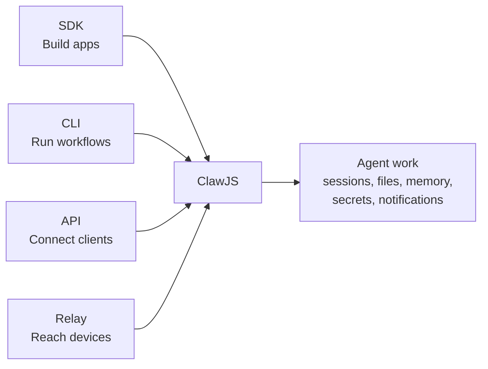

<p align="center">
  
</p>

# ClawJS

ClawJS is a local-first Agent OS for building runtime-aware agent apps.

It gives builders one framework surface for the pieces that agent products keep
rebuilding: runtime adapters, local workspace state, host boundaries, sessions,
memory, secrets, files, media, notifications, data services, remote relay, and
operator-facing control planes.

| Surface | Best for | Example |
| --- | --- | --- |
| SDK | local Node.js application code | `claw.sessions.listSessions()` |
| CLI | operator and automation workflows | `claw sessions list --json` |
| Relay API | remote browser, mobile, or server clients | `GET /v1/tenants/:tenantId/agents/:agentId/workspaces/:workspaceId/sessions` |

Full comparison: [docs/interface-matrix.md](docs/interface-matrix.md)

## What You Build On

ClawJS turns the recurring plumbing of agent products into one local-first
surface: build apps, run workflows, connect clients, and keep agent work
portable across hosts.



Create once, then expose the same capabilities to local apps, native hosts,
automation scripts, and remote control planes. Naming and stability rules live
in [ADR 0001](docs/adr/0001-naming-and-stability-surfaces.md).

## Repository Map

```text
agents/        agent-facing guidance and wiki
apps/          human-facing apps and host surfaces
assets/        shared brand and runtime assets
audio/         audio service plus voice service
bridge/        local bridge service
browser/       browser host/shared primitives
content/       content and publishing control plane
database/      namespace database service
delegation/    async agent delegation control plane
docs/          canonical Markdown documentation
drive/         local-first drive/files service
examples/      demos, mocks, fixtures, and starter showcases
execution/     agent-authored code execution control plane
integrations/  provider and channel services
iot/           local-first IoT control plane
memory/        typed local memory CLI/service
mcp/           MCP service surface
modules/       optional domain capability packs
monitor/       health and runtime monitoring service
notify/        notification delivery service
packages/      published npm packages and scaffolds
publishing/    publication workflow service
relay/         public HTTPS relay and reverse connector layer
runtime/       runtime service loops
scripts/       repository automation
secrets/       vault and secret broker
sessions/      session mirror and import service
skills/        built-in design and generation skills
storage/       storage UI/runtime support
tests/         repository-level tests
time/          calendar, routines, reminders, and watches
website/       docs-site runtime wrapper
wiki/          local-first wiki service
```

The canonical folder ownership map lives in
[docs/repository-map.md](docs/repository-map.md).

## Core Packages

- `@clawjs/claw`: official SDK.
- `@clawjs/cli`: official `claw` CLI.
- `@clawjs/core`: shared contracts and schemas.
- `@clawjs/workspace`: local-first workspace layer.
- `@clawjs/node`: compatibility wrapper.
- `@clawjs/database`, `@clawjs/audio`, `@clawjs/sessions`,
  `@clawjs/runtime`, `@clawjs/user-model`, and related packages: reusable
  service clients and runtime contracts.
- `create-claw-app`, `create-claw-agent`, `create-claw-server`, and
  `create-claw-plugin`: scaffolding packages.

Full package surface: [docs/surface.md](docs/surface.md)

## Install

Use the SDK:

```bash
npm install @clawjs/claw
```

Install the CLI globally:

```bash
npm install -g @clawjs/cli
claw --help
```

Or run the latest CLI without a global install:

```bash
npx @clawjs/cli@latest --help
```

## Start Here

- [Getting Started](docs/getting-started.md)
- [CLI reference](docs/cli.md)
- [API reference](docs/api.md)
- [Runtime adapters](docs/runtime.md)
- [Interface matrix](docs/interface-matrix.md)
- [Repository map](docs/repository-map.md)
- [Host ownership](docs/host-ownership.md)
- [Support matrix](docs/support-matrix.md)

## Experimental Status

> [!WARNING]
> ClawJS is currently experimental, pre-beta software. Expect breaking changes
> to APIs, CLI behavior, config formats, workspace layout, and stored data
> structures.
>
> Do not use ClawJS in production. Do not connect it to sensitive systems, real
> user data, paid APIs, security-critical services, or important integrations.
>
> Use it only for local evaluation and disposable test setups, ideally on an
> isolated machine, VM, or sandboxed environment.

## Repository Development

```bash
npm ci
npm --prefix examples/demo ci
npm --prefix website ci
npx playwright install --with-deps chromium
npm run ci
```

The release gate intentionally includes tests, typechecks, package builds,
website build, docs validation, tarball smoke tests, and the blocking hermetic
Playwright suite.

Git and release branch policy: [docs/git-workflow.md](docs/git-workflow.md)

## Maintainer

Maintainer: Iván González Dávila ([`@ivangdavila`](https://github.com/ivangdavila)).

Repository ownership, issue tracking, and package publishing live under
[`@clawic`](https://github.com/clawic).
