# Claw persistent surface

Generated from `claw inspect render --format markdown`. Do not edit by hand.
Use `claw inspect --manifest <path>` or `CLAW_INSPECT_MANIFEST=path[,path...]` to fuse static manifests from other language builders during inspection.

## Tree

```mermaid
flowchart TD
  claw_global["Claw global home\nroot"]
  claw_workspace["Claw workspace state\nroot"]
  clawix_home["Clawix host home\nroot"]
  claw_database_core["Framework main database\ndatabase"]
  claw_global --> claw_database_core
  claw_database_core_table_workspace_records["workspace_records\ntable"]
  claw_database_core --> claw_database_core_table_workspace_records
  claw_database_core_table_workspace_records_column_collection_name["collection_name\ncolumn"]
  claw_database_core_table_workspace_records --> claw_database_core_table_workspace_records_column_collection_name
  claw_database_core_table_workspace_records_column_record_id["record_id\ncolumn"]
  claw_database_core_table_workspace_records --> claw_database_core_table_workspace_records_column_record_id
  claw_database_core_table_workspace_records_column_payload_json["payload_json\ncolumn"]
  claw_database_core_table_workspace_records --> claw_database_core_table_workspace_records_column_payload_json
  claw_database_core_table_workspace_records_column_updated_at["updated_at\ncolumn"]
  claw_database_core_table_workspace_records --> claw_database_core_table_workspace_records_column_updated_at
  claw_database_core_table_workspace_records_column_archived_at["archived_at\ncolumn"]
  claw_database_core_table_workspace_records --> claw_database_core_table_workspace_records_column_archived_at
  claw_database_core_table_workspace_records_index_workspace_records_collection_updated_idx["workspace_records_collection_updated_idx\nindex"]
  claw_database_core_table_workspace_records --> claw_database_core_table_workspace_records_index_workspace_records_collection_updated_idx
  claw_database_core_table_workspace_meta["workspace_meta\ntable"]
  claw_database_core --> claw_database_core_table_workspace_meta
  claw_database_core_table_workspace_meta_column_meta_key["meta_key\ncolumn"]
  claw_database_core_table_workspace_meta --> claw_database_core_table_workspace_meta_column_meta_key
  claw_database_core_table_workspace_meta_column_meta_value["meta_value\ncolumn"]
  claw_database_core_table_workspace_meta --> claw_database_core_table_workspace_meta_column_meta_value
  claw_database_runtime["Runtime sidecar database\nsidecar"]
  claw_global --> claw_database_runtime
  claw_database_sessions["Sessions sidecar database\nsidecar"]
  claw_global --> claw_database_sessions
  claw_database_audio["Audio sidecar database\nsidecar"]
  claw_global --> claw_database_audio
  claw_database_search["Search sidecar database\nsidecar"]
  claw_global --> claw_database_search
  claw_database_notify["Notify sidecar database\nsidecar"]
  claw_global --> claw_database_notify
  claw_database_feed["Feed sidecar database\nsidecar"]
  claw_global --> claw_database_feed
  claw_database_monitor["Monitor sidecar database\nsidecar"]
  claw_global --> claw_database_monitor
  claw_workspace_manifest["Workspace manifest\nfile"]
  claw_workspace --> claw_workspace_manifest
  claw_workspace_desiredState["desiredState\nfolder"]
  claw_workspace --> claw_workspace_desiredState
  claw_workspace_observedState["observedState\nfolder"]
  claw_workspace --> claw_workspace_observedState
  claw_workspace_projections["projections\nfolder"]
  claw_workspace --> claw_workspace_projections
  claw_workspace_sessions["sessions\nfolder"]
  claw_workspace --> claw_workspace_sessions
  claw_workspace_audit["audit\nfolder"]
  claw_workspace --> claw_workspace_audit
  claw_workspace_locks["locks\nfolder"]
  claw_workspace --> claw_workspace_locks
  claw_workspace_backups["backups\nfolder"]
  claw_workspace --> claw_workspace_backups
  claw_workspace_browser["browser\nfolder"]
  claw_workspace --> claw_workspace_browser
  claw_workspace_styles["styles\nfolder"]
  claw_workspace --> claw_workspace_styles
  claw_workspace_templates["templates\nfolder"]
  claw_workspace --> claw_workspace_templates
  claw_workspace_references["references\nfolder"]
  claw_workspace --> claw_workspace_references
  claw_global_config["config\nfolder"]
  claw_global --> claw_global_config
  claw_global_data["data\nfolder"]
  claw_global --> claw_global_data
  claw_global_state["state\nfolder"]
  claw_global --> claw_global_state
  claw_global_cache["cache\nfolder"]
  claw_global --> claw_global_cache
  claw_global_logs["logs\nfolder"]
  claw_global --> claw_global_logs
  claw_global_run["run\nfolder"]
  claw_global --> claw_global_run
  claw_global_tmp["tmp\nfolder"]
  claw_global --> claw_global_tmp
  claw_global_skills["skills\nfolder"]
  claw_global --> claw_global_skills
  clawix_home_data["data\nfolder"]
  clawix_home --> clawix_home_data
  clawix_home_state["state\nfolder"]
  clawix_home --> clawix_home_state
  clawix_home_cache["cache\nfolder"]
  clawix_home --> clawix_home_cache
  clawix_home_logs["logs\nfolder"]
  clawix_home --> clawix_home_logs
  clawix_home_run["run\nfolder"]
  clawix_home --> clawix_home_run
  clawix_home_tmp["tmp\nfolder"]
  clawix_home --> clawix_home_tmp
  clawix_home_bridgeSocket["bridgeSocket\nsocket"]
  clawix_home --> clawix_home_bridgeSocket
  claw_external_codex["Codex home\nexternalReadOnlySource"]
  claw_legacy_workspace_clawjs["Legacy pre-public workspace root\nlegacyPath"]
```

## Nodes

| ID | Kind | Owner | Path / Key |
| --- | --- | --- | --- |
| `claw.global` | root | claw | `~/.claw` |
| `claw.workspace` | root | claw | `.claw` |
| `clawix.home` | root | clawix | `~/.clawix` |
| `claw.database.core` | database | claw | `~/.claw/data/core.sqlite` |
| `claw.database.core.table.workspace_records` | table | claw | `` |
| `claw.database.core.table.workspace_records.column.collection_name` | column | claw | `` |
| `claw.database.core.table.workspace_records.column.record_id` | column | claw | `` |
| `claw.database.core.table.workspace_records.column.payload_json` | column | claw | `` |
| `claw.database.core.table.workspace_records.column.updated_at` | column | claw | `` |
| `claw.database.core.table.workspace_records.column.archived_at` | column | claw | `` |
| `claw.database.core.table.workspace_records.index.workspace_records_collection_updated_idx` | index | claw | `` |
| `claw.database.core.table.workspace_meta` | table | claw | `` |
| `claw.database.core.table.workspace_meta.column.meta_key` | column | claw | `` |
| `claw.database.core.table.workspace_meta.column.meta_value` | column | claw | `` |
| `claw.database.runtime` | sidecar | claw | `~/.claw/data/runtime.sqlite` |
| `claw.database.sessions` | sidecar | claw | `~/.claw/data/sessions.sqlite` |
| `claw.database.audio` | sidecar | claw | `~/.claw/data/audio.sqlite` |
| `claw.database.search` | sidecar | claw | `~/.claw/data/search.sqlite` |
| `claw.database.notify` | sidecar | claw | `~/.claw/data/notify.sqlite` |
| `claw.database.feed` | sidecar | claw | `~/.claw/data/feed.sqlite` |
| `claw.database.monitor` | sidecar | claw | `~/.claw/data/monitor.sqlite` |
| `claw.workspace.manifest` | file | claw | `.claw/manifest.json` |
| `claw.workspace.desiredState` | folder | claw | `.claw/state/desired` |
| `claw.workspace.observedState` | folder | claw | `.claw/state/observed` |
| `claw.workspace.projections` | folder | claw | `.claw/projections` |
| `claw.workspace.sessions` | folder | claw | `.claw/sessions` |
| `claw.workspace.audit` | folder | claw | `.claw/audit` |
| `claw.workspace.locks` | folder | claw | `.claw/locks` |
| `claw.workspace.backups` | folder | claw | `.claw/backups` |
| `claw.workspace.browser` | folder | claw | `.claw/browser` |
| `claw.workspace.styles` | folder | claw | `.claw/styles` |
| `claw.workspace.templates` | folder | claw | `.claw/templates` |
| `claw.workspace.references` | folder | claw | `.claw/references` |
| `claw.global.config` | folder | claw | `~/.claw/config.yaml` |
| `claw.global.data` | folder | claw | `~/.claw/data` |
| `claw.global.state` | folder | claw | `~/.claw/state` |
| `claw.global.cache` | folder | claw | `~/.claw/cache` |
| `claw.global.logs` | folder | claw | `~/.claw/logs` |
| `claw.global.run` | folder | claw | `~/.claw/run` |
| `claw.global.tmp` | folder | claw | `~/.claw/tmp` |
| `claw.global.skills` | folder | claw | `~/.claw/skills` |
| `clawix.home.data` | folder | clawix | `~/.clawix/data` |
| `clawix.home.state` | folder | clawix | `~/.clawix/state` |
| `clawix.home.cache` | folder | clawix | `~/.clawix/cache` |
| `clawix.home.logs` | folder | clawix | `~/.clawix/logs` |
| `clawix.home.run` | folder | clawix | `~/.clawix/run` |
| `clawix.home.tmp` | folder | clawix | `~/.clawix/tmp` |
| `clawix.home.bridgeSocket` | socket | clawix | `~/.clawix/run/clawix-bridge.sock` |
| `claw.external.codex` | externalReadOnlySource | external | `~/.codex` |
| `claw.legacy.workspace.clawjs` | legacyPath | claw | `.clawjs` |
